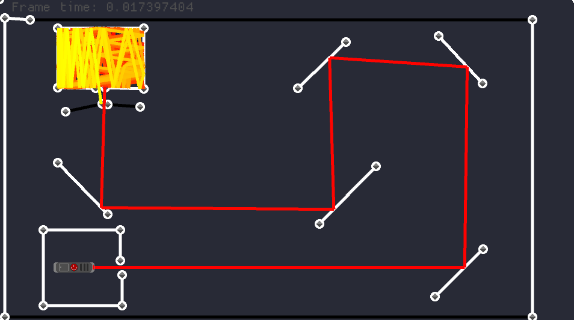

# Лазерное шоу

Проект "Ray Cast" - это программа, написанная на языке программирования Rust, является песочницей, состоит из:

- Лазерная указка - (чем больше он отражается тем сильнее, сдвигается его цвет (нет))
- Узлы - (они нужны, чтобы управлять стенами и соединять их)
- Стены - (присутствуют три вида стен, зеркальные, поглощающие и прозрачные)

## Описание

Программа предоставляет пользователю интерфейс для ручного создания и расстановки узлов и стен. Пользователь может
создавать объекты прямо в программе с помощью мыши или другого устройства ввода.
Программа рассчитывает траекторию луча в реальном времени.

## Управление
* Левой кнопкой мыши можно **перемещать** узлы, а также **менять тип** стен с зеркального на поглощающий и по кругу.

* Правой кнопкой мыши можно **создавать узлы**, кликнув по пустому месту, **создавать стены**, кликнув по узлу,
  а затем по другому узлу или в пустом месте.
* Средней кнопкой мыши можно **удалять** стены и узлы.
* На кнопку Tab можно открыть ui интерфейс управления лазера и не только.
    * Перемещение лазера
    * Вращение лазера
    * Изменение толщины лазера
* На кнопку CapsLock можно отключить просчитывание столкновений.

## Установка и запуск

1. Установите Rust, если он еще не установлен, следуя
   [официальным инструкциям](https://www.rust-lang.org/tools/install).

2. Склонируйте репозиторий с проектом "Лазерное шоу":
    ```bash
    git clone https://github.com/ArtiArtem8/ray_cast
    ```

3. Перейдите в директорию проекта:
    ```bash
    cd ray_cast
    ```

4. Запустите программу с помощью Cargo:
    ```bash
    cargo run
    ```

## Использование

1. Запустите программу, следуя инструкциям установки и запуска.

2. Используйте мышь или другое устройство ввода.

## Пример




## Автор

Автор проекта "Лазерное шоу": Шитиков Артём (xvch77guw@mozmail.com)

## Лицензия

Этот проект лицензируется по лицензии MIT.
